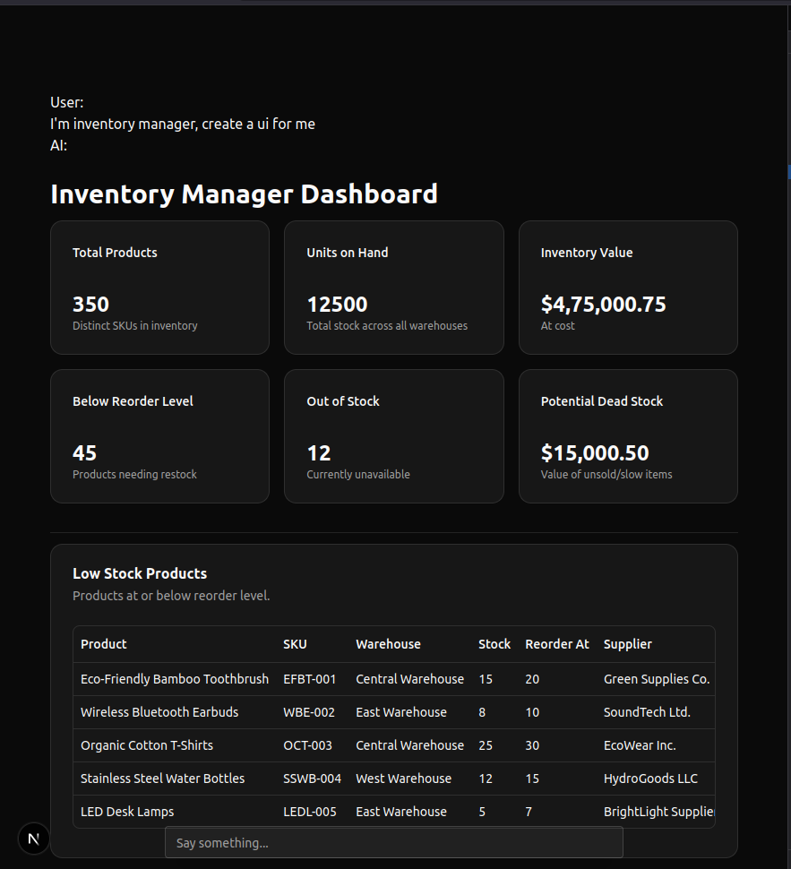

# UnView Generative UI

UnView - Get rid of views.

> This is wip, its not even presentable right now. 

## Problem
For most erp projects, making 100s of forms and tables eats most of our time. In most cases the ui takes much longer to build than the actual api with all business logic. And even after all that, most users don't even use most of those screens.

## Maybe a solution
Instead of forcing every user to use the same ui screens, we can let llm generate a ui tailored for that user, user tells what they want in screen, and llm generated that screen.

## Flow
- provide tools to llm, one tool for each api endpoint (or a mcp server)
- user specifies what they need
- llm fetches data and using generic component to create a super personalized, focused, distraction free ui for that user.

## Why not use AG-UI Protocol (with copilotkit)?

It true, i might eventually end up creating what ag ui already provides. But there were some differences.

- I dont want to create specialized components like Users Table that both fetches data and also renders it. Because then i would have to create specialized table components for every entity in db. What i want instead is a very generic table component that i can give to llm. So llm can fetch any data using tools and use table to display it

- Nesting items is crucial for dynamic layouts. Ag ui looks like its designed for one off components.

## Setup
- create `.env` file by copying `example-env` file, and add you open ai key
- run `npm install`
- and then `npm run dev`